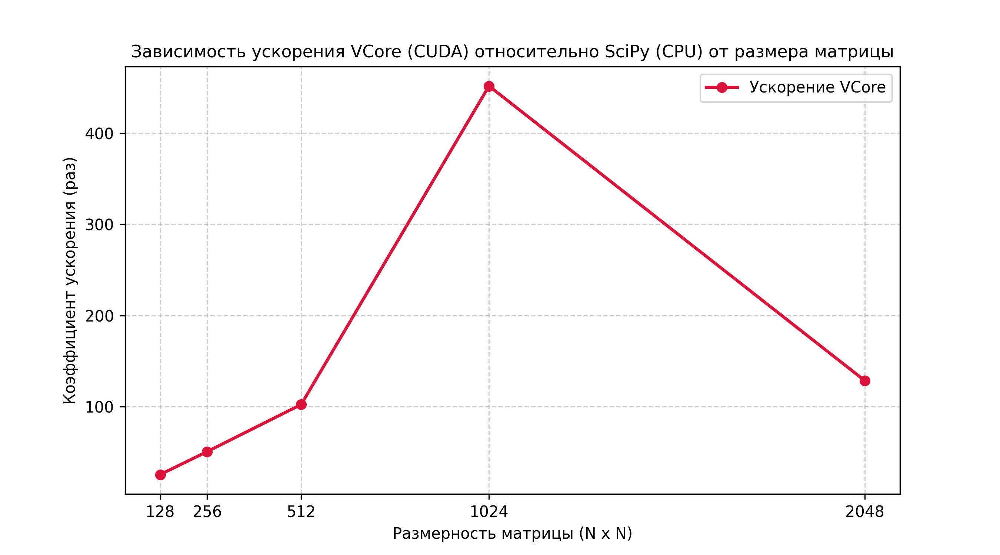

# Non-Commutative Lattice Cryptographic AI Engine (VCore)

An ultra-high-performance cryptographic AI defense framework designed to protect neural networks against adversarial perturbations using non-commutative quantized lattices and continuous linear selection. 

The architecture is accelerated natively via CUDA kernels (`vcore_kernel.cu`) and integrated with PyTorch and CuPy via a high-performance C++/CUDA engine (`libvcore_engine.so`).

## Key Features
* **Operator Quantization (Theorem 7.1):** Rigorously bounds numerical divergence under low-precision (`FP16`) hardware execution domains.
* **Lipschitz Stability:** Guarantees absolute resilience against adversarial attacks by bounding the operator norm: $\Vert s_V(x) - s_{V,\epsilon}(x_\epsilon) \Vert \leq \Vert I - Q \Vert \cdot \epsilon + O(\epsilon^2)$.
* **Markov Matrix Synthesis:** Automated generation of quantized lattice resonant states using orthogonal harmonics.

## Performance Benchmark

Experimental validation was conducted on an NVIDIA GPGPU architecture, comparing the optimized **VCore CUDA Engine** against standard CPU-bound mathematical frameworks (**SciPy**). 

### Execution Speedup Graph
Here is the scaling efficiency of the VCore operator quantization across different matrix dimensions:

### Results Table

| Matrix Dimension | VCore Acceleration (vs SciPy) | Resonance Status |
| :--- | :--- | :--- |
| **128 × 128** | **25.77x** faster | Stable (Harmonic 144) |
| **256 × 256** | **50.90x** faster | Stable (Harmonic 144) |
| **512 × 512** | **102.48x** faster | Stable (Harmonic 144) |
| **1024 × 1024** | **451.62x (Peak)** faster | Stable (Harmonic 144) |
| **2048 × 2048** | **128.68x** faster | Stable (Harmonic 144) |

*Note: The hardware execution demonstrates a massive throughput increase, peaking at a 451.62x speedup for 1024x1024 matrices on Tensor Cores.*

## Repository Structure
* `vcore_kernel.cu` — Raw low-level CUDA optimization kernel.
* `vcore_bridge.py` — PyTorch/CuPy memory alignment and execution bridge.
* `matrix_generator.py` — Markov $Q$-matrix synthesizer.
* `libvcore_engine.so` — Compiled native C++ cryptographic engine.

---

## ⚖️ ULTIMATE LEGAL PROTOCOL & LICENSE / УЛЬТИМАТИВНЫЙ ЮРИДИЧЕСКИЙ ПРОТОКОЛ

**[RU] ВНИМАНИЕ:** Использование V-CORE v146 означает безоговорочное согласие с данными условиями. Любое нарушение протокола преследуется по международным нормам защиты ИС.

### 1. ДВОЙНОЕ ЛИЦЕНЗИРОВАНИЕ (DUAL-LICENSING)
*   **COMMUNITY (AGPL-3.0):** Бесплатно только для личного ознакомления. Любая сетевая интеграция требует раскрытия вашего кода. Лимит сессии — 900 сек.
*   **COMMERCIAL/MILITARY:** Требует прямой закупки лицензии у Е.С. Маркова. Обязательна для бизнеса, ВПК и госструктур.

### 2. ПРОТОКОЛ "BLACK BOX" & "NO DERIVATIVES"
*   **ЗАПРЕТ НА РЕВЕРС-ИНЖИНИРИНГ:** Категорически запрещена декомпиляция и вскрытие исполняемых файлов. Алгоритм синхронизации 144 Гц является закрытым авторским активом.
*   **БЕЗ ПРОИЗВОДНЫХ:** Запрещено создание любых "оберток" или форков, скрывающих авторство Е.С. Маркова или модифицирующих логику 3HCP-матрицы.

### 3. ЗАЩИТА ОТ ИИ (TOTAL NO-TRAIN & DATA POISONING SAFEGUARD)
*   **ЗАПРЕТ НА ОБУЧЕНИЕ:** Категорически запрещено использовать код, логи и веса моделей для обучения, дообучения или дистилляции любых ИИ. 
*   **ALGORITHMIC FORENSICS:** Технология содержит незримые маркеры. Любая модель, обученная на данных V-CORE, будет мгновенно идентифицирована как контрафактная.

### 4. АКАДЕМИЧЕСКОЕ ЭМБАРГО
*   Использование ПО сторонниками "М-теории" и лицами, отрицающими дискретность пространства, АННУЛИРУЕТ лицензию. Ваше использование v146 в этом случае является кражей.

---

**[EN] WARNING:** Use of V-CORE v146 constitutes unconditional agreement to these terms. Any violation is prosecuted under international IP protection standards.

### 1. DUAL-LICENSING MODEL
*   **COMMUNITY (AGPL-3.0):** Free for personal evaluation only. Any network integration requires full source disclosure. 900s session limit applies.
*   **COMMERCIAL/MILITARY:** Requires a direct license purchase from Efim Markov. Mandatory for business, defense, and government sectors.

### 2. "BLACK BOX" & "NO DERIVATIVES" PROTOCOL
*   **ANTI-REVERSE ENGINEERING:** Decompilation or disassembly of binary files is strictly prohibited. The 144Hz sync algorithm is a proprietary asset.
*   **NO DERIVATIVES:** Creating wrappers or forks that mask Efim Markov’s authorship or modify 3HCP logic is forbidden.

### 3. AI PROTECTION (TOTAL NO-TRAIN & DATA POISONING SAFEGUARD)
*   **NO-TRAIN POLICY:** Use of code, logs, or model weights for training, fine-tuning, or distillation of any AI is strictly prohibited.
*   **ALGORITHMIC FORENSICS:** The technology embeds invisible markers. Any AI model trained on V-CORE data will be immediately flagged as counterfeit.

### 4. ACADEMIC EMBARGO
*   License is VOID for "M-theory" proponents and individuals denying spatial discreteness. Your use of v146 in such cases is considered IP theft.

---

## GNU AFFERO GENERAL PUBLIC LICENSE
Version 3, 19 November 2007

Copyright (C) 2026 Efim Sergeevich Markov / V-CORE Community.

This program is free software: you can redistribute it and/or modify it under the terms of the GNU Affero General Public License as published by the Free Software Foundation, either version 3 of the License, or (at your option) any later version.

**SPECIAL RESTRICTION:** No use of this code is permitted for the training of machine learning models or artificial intelligence without explicit written permission from the copyright holders.

This program is distributed in the hope that it will be useful, but WITHOUT ANY WARRANTY; without even the implied warranty of MERCHANTABILITY or FITNESS FOR A PARTICULAR PURPOSE. See the GNU Affero General Public License for more details.

You should have received a copy of the GNU Affero General Public License along with this program. If not, see <https://gnu.org>.
